# 로그인 경보 자동화 봇

## ① 무엇을 만들었는지

Python으로 로그인 경보 데이터를 만들어 n8n Webhook으로 전송하면, n8n이 로그인 레벨에 따라 `allow`/`deny`와 `severity`를 판정하고 메신저로 알림을 보내며 Flask REST API를 통해 보안 이벤트를 MySQL에 저장하는 자동화 실습입니다.

심화 단계에서는 통계 조회 API, 분기별 메신저 전송, Discord Embed 카드, Windows 작업 스케줄러를 이용한 5분 주기 자동 실행까지 구성했습니다.

## ② 작업 내역

### 사용한 것

- Python 3 (`requests`, `json`)
- n8n 2.37.7 (Docker)
- n8n Webhook / Code / IF / HTTP Request 노드
- Flask + SQLAlchemy
- MySQL (Docker)
- Slack / Discord / Telegram
- Windows 작업 스케줄러

### 만든 순서

1. `alert_sender.py`에서 로그인 경보 목록을 JSON으로 만들어 n8n Webhook으로 POST하도록 구현했습니다.
2. n8n Webhook으로 Python이 보낸 경보 데이터를 받았습니다.
3. Code 노드(JavaScript)에서 `level`을 기준으로 `severity`, `decision`, `reason`을 판정했습니다.
   - `level >= 10` → `High / deny`
   - `level >= 7` → `Medium / allow`
   - 그 외 → `Low / allow`
4. IF 노드에서 `decision` 값에 따라 `deny`와 `allow`을 두 갈래로 분기했습니다.
5. 각 분기에서 거부는 `🚫`, 허용은 `✅`로 시작하는 서로 다른 메시지를 만들었습니다.
6. Slack, Discord, Telegram으로 알림을 전송하고 Flask의 `POST /api/security/events`를 통해 DB에도 결과를 저장했습니다.
7. REST API의 인증·필수값 검증 결과를 확인했습니다.
   - API Key 없이 요청 → `401`
   - 필수값 누락 → `400`
   - 정상 요청 → `201`
8. 심화 단계에서 `/api/security/events/summary?student=<이름>`으로 통계를 확인하고, 허용 경로는 Slack만 사용하도록 분기를 조정했습니다.
9. Discord에는 `embeds`를 적용하여 거부/허용 결과를 색상으로 구분했습니다.
10. Windows 작업 스케줄러에 `alert_sender.py`를 5분마다 실행하도록 등록했습니다.

## ③ 기능 구현 화면

### n8n Code 노드 판정 결과

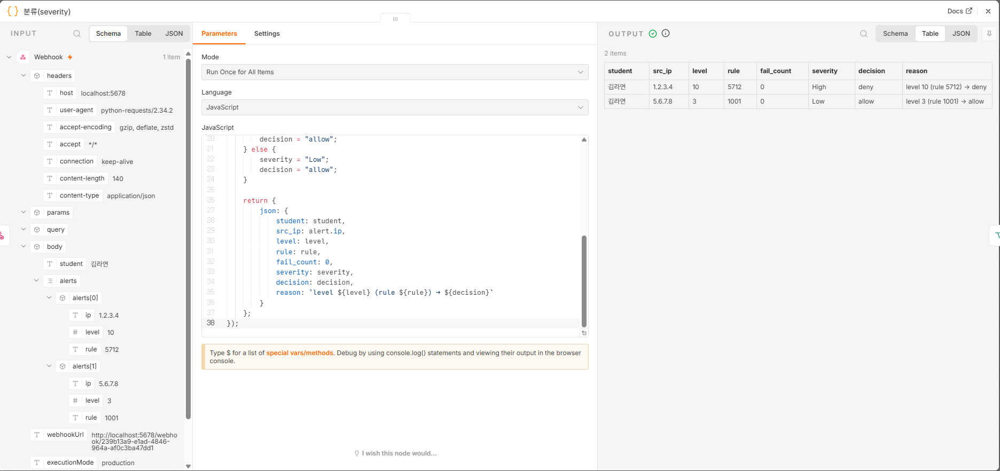

레벨 10과 레벨 3 경보에 대해 각각 `decision`, `severity`, `reason`이 생성되는 것을 확인했습니다.

### n8n 분기 실행

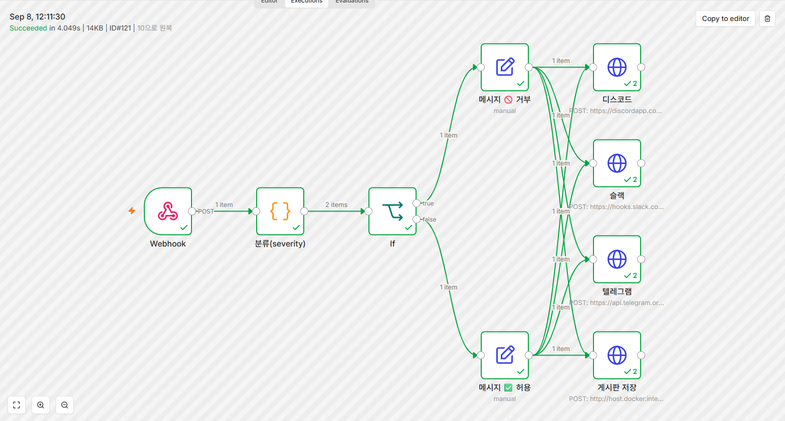

거부와 허용 두 분기가 정상적으로 실행되는 것을 확인했습니다.

### Slack 알림

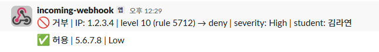

거부와 허용 메시지가 서로 다른 형식으로 도착하는 것을 확인했습니다.

### Discord 알림

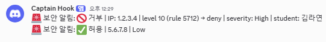

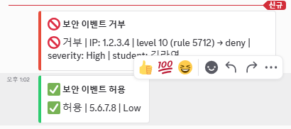

Discord에서 거부/허용 결과가 Embed 카드와 색상으로 구분되는 것을 확인했습니다.

### Telegram 알림

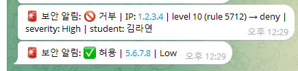

Telegram에 거부와 허용 알림이 도착하는 것을 확인했습니다.

### 게시판 REST API

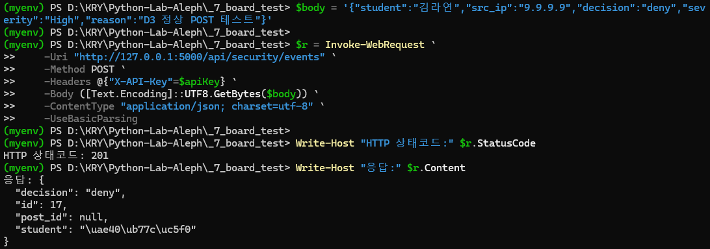

정상 요청에서 `201`과 반환된 `id`를 확인했습니다.

### MySQL 저장 결과

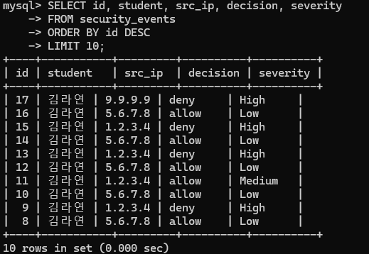

`security_events` 테이블에 학생 이름과 `deny`/`allow` 결과가 저장되는 것을 확인했습니다.

### n8n 게시판 저장 실행

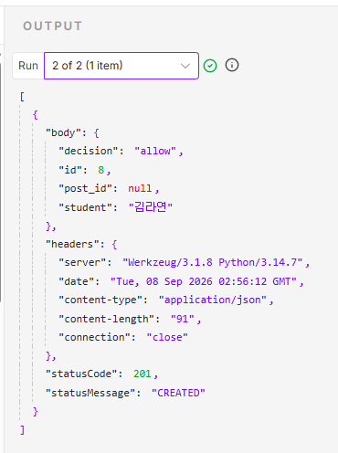

n8n의 `게시판 저장` 노드에서 `201` 응답이 반환되는 것을 확인했습니다.

### 심화: 통계 조회

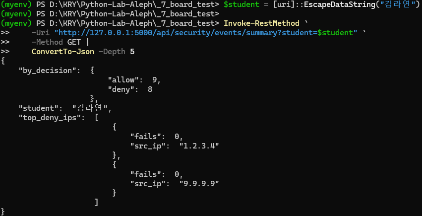

학생별 허용/거부 건수와 거부 상위 IP를 조회했습니다.

### 심화: Windows 작업 스케줄러

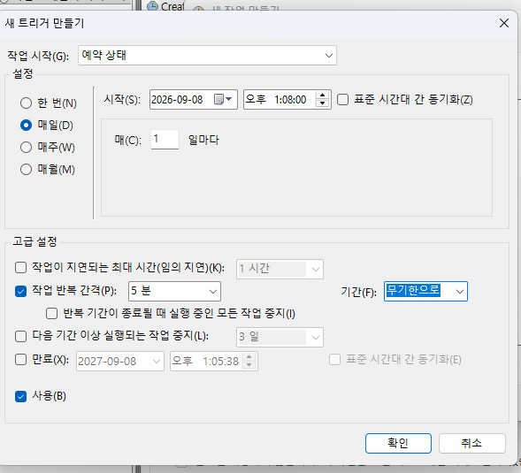

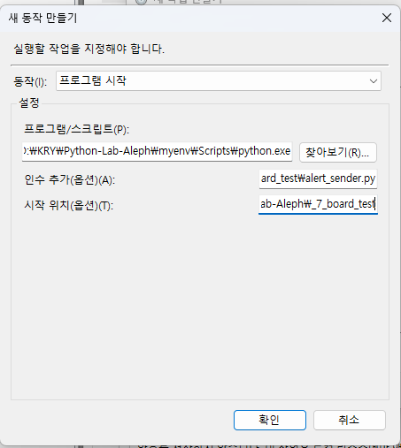


Windows 작업 스케줄러에서 5분 주기로 `alert_sender.py`가 실행되도록 설정하고 실행 성공을 확인했습니다.

## ④ 실행 방법

### ① 켜는 것

1. Docker Desktop을 실행합니다.
2. MySQL과 n8n 컨테이너가 실행 중인지 `docker ps`로 확인합니다.
3. `_7_board_test` 폴더에서 `.env`를 준비합니다.
4. Flask 게시판 서버를 실행합니다.

```powershell
python app.py
```

5. n8n에서 워크플로를 실행할 수 있는 상태로 준비합니다.

### ② 실행하는 것

```powershell
python alert_sender.py
```

Python 전송기가 n8n Webhook으로 로그인 경보 2건을 전송합니다.

### ③ 무엇이 보이면 성공인가

- `alert_sender.py`에서 n8n 응답 `200`
- n8n Code 노드에서 `deny/High`, `allow/Low` 판정
- 메신저 알림 도착
- `security_events` 테이블에 저장
- n8n의 게시판 저장 요청에서 `201`

이 확인되면 정상 동작입니다.

### ④ 안 될 때 보는 곳

1. n8n **Executions**에서 빨간색으로 실패한 노드를 확인합니다.
2. Flask 서버 터미널에서 HTTP 응답 상태를 확인합니다.
3. MySQL `security_events` 테이블에 데이터가 저장됐는지 확인합니다.
4. Telegram 등 외부 메신저 연결 오류가 발생하면 네트워크 연결 상태도 확인합니다.

## ⑤ 막혔던 점과 해결 방법

### 1. n8n Code 노드에서 Python 실행 오류

Python 실행 환경이 준비되지 않아 Python runner 관련 오류가 발생했습니다.

**해결:** Code 노드를 JavaScript로 사용하고 판정 로직을 JavaScript 문법에 맞게 작성했습니다.

### 2. PowerShell에서 Webhook 요청 방식 오류

PowerShell에서 처음 Webhook에 GET 방식으로 JSON Body를 보내려고 했을 때 정상적으로 처리되지 않았습니다.

**해결:** Webhook의 목적에 맞게 POST 방식으로 변경하고 JSON Body를 함께 전송했습니다.

### 3. Telegram 전송 연결 오류

Telegram API에 연결할 때 일시적으로 연결 거부가 발생했습니다.

**해결:** `Test-NetConnection`으로 연결 상태를 확인한 뒤 HTTPS 요청 자체가 가능한지 `curl.exe -I https://api.telegram.org`로 다시 확인하고 정상 응답을 확인한 후 재실행했습니다.

## 심화 구현

### S1. 통계 조회

`GET /api/security/events/summary?student=<이름>`으로 허용/거부 건수와 거부 상위 IP를 조회했습니다.

### S2. 분기별 메신저 전송

거부 결과는 여러 메신저로 전달하고, 허용 결과는 Slack 중심으로 전달하도록 분기했습니다.

### S3. Discord Embed

Discord 메시지에 `embeds`를 적용하고 거부/허용 결과를 서로 다른 색상으로 구분했습니다.

### S4. 자동 실행

Windows 작업 스케줄러에서 `alert_sender.py`가 5분마다 자동 실행되도록 설정했습니다.

## 보안 주의

Webhook URL, Bot Token, API Key 등의 실제 비밀값은 저장소에 올리지 않습니다. 제출용 n8n Export JSON에서는 실제 비밀값을 `<...>` 형태로 제거했습니다.

`.env`는 Git에 포함하지 않고 `.env.example`을 공유용 설정 예시로 사용합니다.
